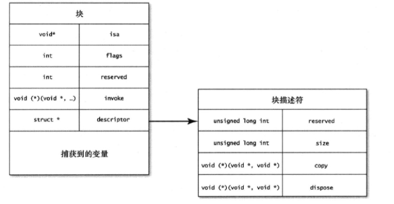

# 理解块的概念
> 块可以实现闭包。

## 块的基础知识

1. block 定义：
	* block 用`^`表示，后面跟`{}`，里面是block的实现代码
	
	* blcok 是个值，也有相关类型，可以把块赋给变量

	* block 类型语法结构
		
			return_type (^ block_name)(parameters) = ^ (parameters) {
				//块的实现代码
			}

2. 在声明block的范围里，所有的变量都可以为其所捕获。

3. 局部变量声明的时候加上`__block`修饰符，就可以在block内修改
4. “内联块”（inline block）：block并未先赋给局部变量，而是直接内联在函数调用里，可以把所有业务逻辑放在一起，便于理解。

		// NSArray 遍历元素时使用的方法
		- (void)enumerateObjectsUsingBlock:(void (NS_NOESCAPE ^)(ObjectType obj, NSUInteger idx, BOOL *stop))block NS_AVAILABLE(10_6, 4_0);

5. 对于类的实例变量或属性，无须添加`__block`就可以在block中进行改变。不过如果block捕获了实例变量，也就自动把`self`变量一并捕获了，因为实例变量是与`self`所指代的实例关联在一起的。
6. block也是对象，也有引用计数，也可以被保留和释放回收。如果block保留了self，self同时也保留了block就会导致保留环。这时候就需要`__weak`来解开这个环。

## 块的内部结构

1. `invoke`: 函数指针，指向块的实现代码。

2. 块其实就是一种代替函数指针的语法结构。
3. `description`变量是指向结构体的指针，每个块里都包含此结构体。
4. 块会把其所捕获的所有变量都拷贝一份。拷贝的不是对象本身，是指向这些对象的指针变量。
5. 执行块时，要从内存中把捕获的变量都读出来

## 全局快、栈块及堆块

1. 局部定义块的时候，其所占的内存区域是分配在栈中的，即，块只在定义它的那个范围内有效。一旦出了这个范围，编译器有可能把分配给块的内存覆写掉。

2. 对block执行`copy`操作，就会把块从栈复制到堆上。因此当把block声明为属性时，其修饰符为`copy`
3. 全局块（global block）:

	* 全局块不会捕捉任何状态，运行时也无须有状态参与。
	
	* 块所使用的整个内存区域，在编译期已经完全确定了。
	* 全局块决不会为系统所回收，实际上相当于单例
	* 全局块只是为了优化

## 总结：

***1. 块是C、C++、Objective-C中的词法闭包***

***2. 块可接受参数，也可返回值***

***3. 块可以分配在栈或堆上，也可以是全局的。分配在栈上的块可拷贝到堆里，这样的话，就和OC对象一样，具备引用计数了***

